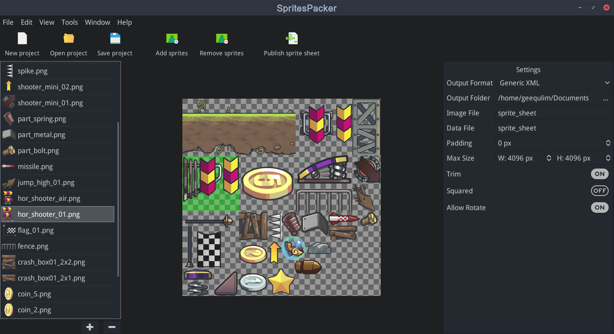

# SpritePacker
A multi platform tool to pack your sprites together.


## TODOS:
- Pack sprites from command line
- Save and load pack configurations
- Add more kind of game engine exporter support

## Contribution

This tool is developed by godot game engine. If you want to contribute to this project that is welcomed.

- Clone this repo
```bash
git clone git@github.com:GodotExplorer/SpritePacker.git --recurse-submodules
```
Or
```bash
git clone https://github.com/GodotExplorer/gdutils.git --recurse-submodules
```
- Move and merge the modules folder into your godot source folder
- [Compile](http://docs.godotengine.org/en/3.0/development/compiling/index.html) the godot editor with the modules
- Open the `editor` folder with the editor compiled from the source code.
- Happy Coding.

## Contributors

- Geequlim
- Wetiontop
- WeiXiong
- sersoong
- 黄伟雄
- tobia88